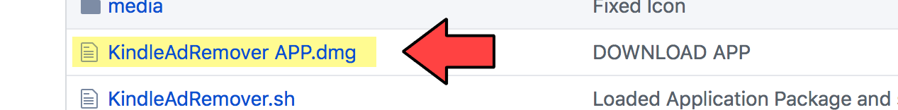
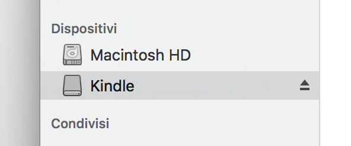

KindleAdRemover
======================
You saved 10 bucks when you bought your preferred eBook reader, but now you are sick of seeing tons of ads on it? If yes, that is for you!

**KindleAdRemover** is a simple script, packaged as application, to automate the boring process of removing Special Offers from your Kindle (not just the screensaver, every ad into your kindle).

## Compatibility

It has been tested with a lot of Paperwhites, but it should as well work with older devices and even newer like Voyage and Oasis.

## Usage

1 - Download the app from github.

2 - Connect your device and be sure it is detected from your Mac.

3 - Launch the application and follow the on-screen instruction.

4 - Done!

## Shell users

Obviously you can launch KindleAdRemover.sh from bash, but you don’t really need me for this…

## Author

* **scugn1zz0** -